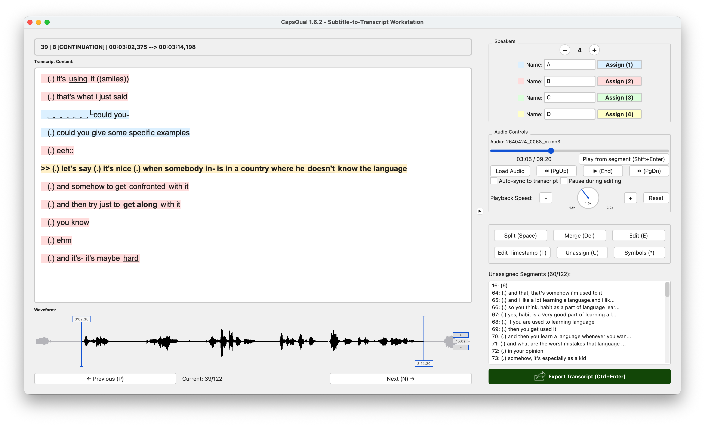
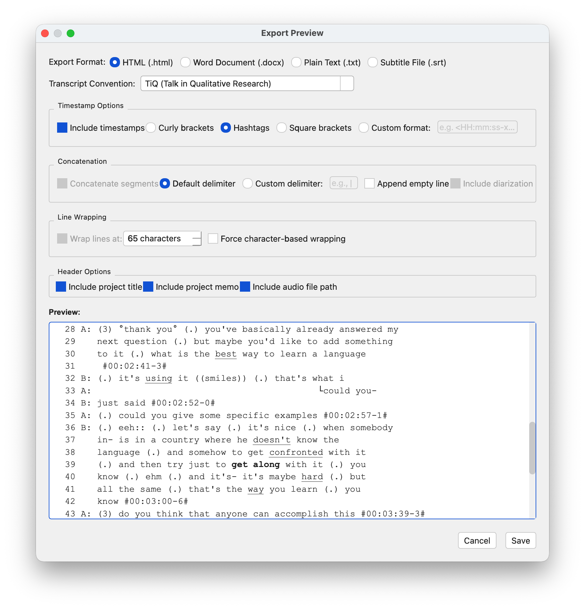

# CapsQual

[](https://github.com/anouarg88/CapsQual/actions/workflows/tests.yml)
[](https://doi.org/10.5281/zenodo.21551449)

CapsQual (formerly CapsGAT) is an open source cross-platform workstation for editing and reformatting subtitle files (.SRT, .VTT, .JSON, .TSV, .TXT) into qualitative interview transcripts based on different conventions such as the minimal version of GAT2 ([Gesprächsanalytisches Transkriptionssystem 2](https://gat-to.uni-jena.de/)), TiQ (Talk in Qualitative Research) and those suggested by Kuckartz and Dresing & Pehl. The GUI enables users to assign speakers to segments quickly using keyboard shortcuts. Audio files can be imported and synced to the transcript. This is meant to reduce window-switching and simplify the formatting process. (Currently all audio features require VLC Player to be installed). CapsQual features essential transcript-editing functionality such as segment splitting and merging, customizable symbols, overlapping speech, pauses, comments and more.  

However, it is not meant as a replacement for dedicated manual transcription software (for full-fledged, professional transcription software, check out [EXMARaLDA](https://www.exmaralda.org)), nor as an all-in-one automated transcription worksuite (for AI-powered transcription with automatic diarization check out [noScribe](https://ai4culture.eu/resources/tools/172)), but as a complementary formatting tool to be used with transcription AI models such as Whisper AI or CapsWriter, aimed at those who wish to efficiently tidy up their automatically transcribed interview-data in a user-friendly, intuitive environment. Projects can be loaded or saved. Transcripts can be exported as .HTML, .DOCX, .TXT or .SRT files.

<picture>
  <source media="(prefers-color-scheme: dark)" srcset="screenshots/screenshot_editor_dark.png">
  
</picture>

# Installation

## System Requirements

- **Windows**: 7 or later (64‑bit recommended)
- **macOS**: 10.13 (High Sierra) or later (Intel and Apple Silicon supported)
- **Linux**: any modern distribution (e.g., Ubuntu 20.04+)
- **RAM**: 512 MB minimum, 2 GB recommended
- **Disk space**: 150 MB for the application, plus space for your projects

For audio features:

- **VLC media player** (download from [videolan.org](https://www.videolan.org/) or run `apt install vlc` in Linux or `brew install vlc` in macOS)


## Installation guide

_Note: Version 1.6.3 has been used as an example in this installation guide. Please replace "1.6.3" with whichever version you are going to install._

### Windows

1. Download the Windows installer `CapsQual_1.6.3_Setup.exe` or the portable executable: `CapsQual_1.6.3.exe`.
2. If you downloaded the installer, double‑click and follow the on‑screen instructions.
3. If you downloaded the portable version, simply unzip the file in any folder and double‑click `CapsQual_1.6.3.exe` to run. A system warning may show up, since this software does not contain any official certificates. You may ignore this at your own discretion.
4. (Optional) Install [VLC](https://www.videolan.org/) for audio features.

To run from source:

```cmd
rem 1. Install Python 3.9+ from python.org (check "Add Python to PATH")
rem 2. Clone the repository
git clone https://github.com/anouarg88/CapsQual.git
cd CapsQual
rem 3. Create a virtual environment
python -m venv venv
venv\Scripts\activate
rem 4. Install dependencies
pip install -r requirements.txt
rem 5. Run
python main.py
```

### macOS

Two versions are provided:

- `CapsQual-macOS-Intel` for Intel‑based Macs (2019 and earlier)
- `CapsQual-macOS-AppleSilicon` for Macs with Apple Silicon (M1, M2, M3)

1. Download the appropriate `.zip` file.
2. Open the downloaded file and drag `CapsQual_1.6.3.app` to your `Applications` folder.
3. The first time you run the app, macOS may warn you that it is from an unidentified developer.  
   To bypass this, right‑click (or Ctrl‑click) the app and select **Open**, then click **Open** again.
4. (Optional) Install [VLC](https://www.videolan.org/) for audio features.

To run from source:

```bash
# 1. Install Python 3.9+ (via Homebrew)
brew install python
# 2. Clone the repository
git clone https://github.com/anouarg88/CapsQual.git
cd CapsQual
# 3. Create a virtual environment
python3 -m venv venv
source venv/bin/activate
# 4. Install dependencies
pip install -r requirements.txt
# 5. (Optional) VLC for audio features.
brew install vlc
# 6. Run
python3 main.py
```

### Linux (Debian/Ubuntu 22.04 or newer)

1. Download `CapsQual_1.6.3-linux.tar.gz`.
2. Open a terminal in the download folder and unfold the archive:
   ```bash
   tar -xzf CapsQual_1.6.3-linux.tar.gz
   ```
3. Make the extracted file executable:
   ```bash
   chmod +x CapsQual_1.6.3
   ```
4. Run the program:
   ```bash
   ./CapsQual_1.6.3
   ```
5. (Optional) Install VLC using your package manager (e.g., `sudo apt install vlc` on Debian/Ubuntu) for audio features.

To run from source (also required for Ubuntu < 22.04):

```bash
# 1. Install system dependencies
sudo apt update && sudo apt install -y python3-venv python3-pyqt5 vlc
# 2. Clone the repository
git clone https://github.com/anouarg88/CapsQual.git
cd CapsQual
# 3. Create a virtual environment
python3 -m venv venv --system-site-packages
source venv/bin/activate
# 4. Install dependencies
pip install -r requirements.txt
# 5. Run
python3 main.py
```

If `pip` is not installed, run `sudo apt install python3-pip` first.


If you encounter difficulties installing CapsQual, feel free to [open an issue](https://github.com/anouarg88/CapsQual/issues).

# Usage

## Quick-start guide


1. **Import audio & subtitles.** After [installation](#installation), Import your files by dragging them onto the CapsQual window, using the menu bar or clicking the **Load Audio** button. If subtitle files are in the same folder as the audio file, CapsQual will offer to import them automatically.


2. **Assign speakers.** Use the number keys (`1`, `2`, `3`, …) or buttons in the top-right corner to assign speakers to the selected segments. Add/remove speakers with the `+` / `−` buttons and rename speakers using the text fields.


3. **Auto-process transcript.** Use **Modify transcript** to strip punctuation or convert everything to lowercase. CapsQual can also convert silent segments into pause symbols.


4. **Review & annotate.** Review the transcript sequentially and split (`Space`), merge (`Del`) and edit (`E/F2`) segments where necessary. Drag the position markers in the waveform viewer or edit timestamps directly (T) to adjust the start and end time of each segment if necessary. Use the **Symbols** button (`*`) to insert pauses, overlaps, comments and other transcription symbols. 


5. **Finalize and export.** Press the Export button or `Ctrl + Enter` to open the export dialog. Choose transcript conventions, customize line-wrapping, timestamps and other options and export as HTML, DOCX, TXT, or SRT.

<picture>
  <source media="(prefers-color-scheme: dark)" srcset="screenshots/screenshot_export_dark.png">
  
</picture>

---

## CLI Usage

CapsQual can also be used from the command line for headless conversion (Run from one directory level above CapsQual):


```bash
# Convert an SRT file to GAT2 transcript
python -m CapsQual transcript.srt

# Launch the GUI
python -m CapsQual -g

# TiQ format with auto-diarization (speaker names before colons)
python -m CapsQual input.srt -f tiq --speaker="$:"

# Export as HTML
python -m CapsQual input.srt -o transcript.html

# Customize layout
python -m CapsQual input.srt -f dresing_pehl --blank-lines
```

**Supported input formats:** `.srt`, `.vtt`, `.txt`, `.tsv`, `.json`  
**Output formats:** GAT2 (default), TiQ, Dresing & Pehl  
**Export types:** `.txt` (default), `.html`, `.docx`

For a full list of options, run `python -m CapsQual --help`.

For more info on how to use CapsQual, see the [CapsQual User Manual](https://github.com/anouarg88/CapsQual/wiki).

# Citation

**If you use this software, please cite it as below:**

Gadermann, A. (2026). *CapsQual: Subtitle-to-Transcript Workstation (Version 1.6.3)*. Computer software. Zenodo. https://doi.org/10.5281/zenodo.21551449

 
**Alternatively, please cite the documentation as below:**

Gadermann, A. (2026). *CapsQual: GUI Tool for Turning ASR Output into Qualitative Transcripts*. Digital Collection of Paderborn University Library (Digitale Sammlungen der Universitätsbibliothek Paderborn). https://doi.org/10.17619/UNIPB/1-2687

---
CapsQual was developed with the help of DeepSeek AI.
